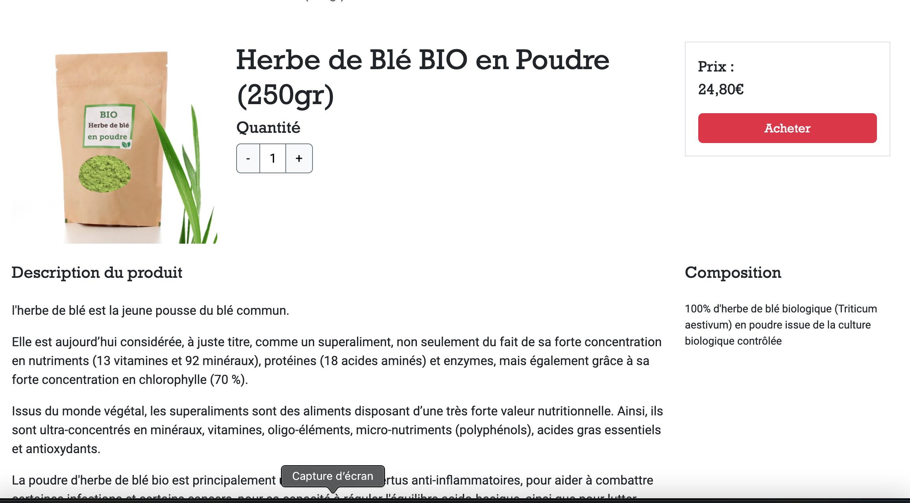
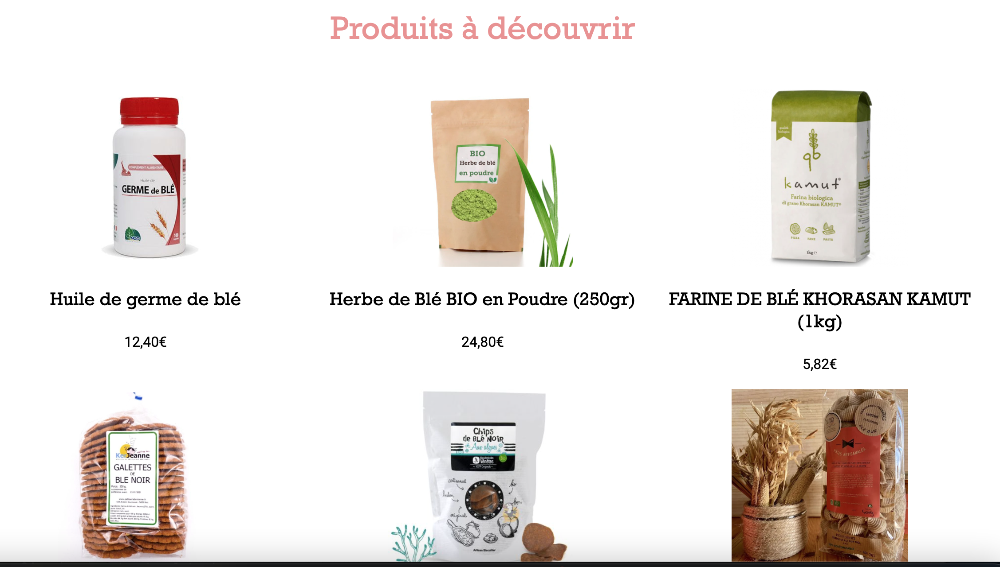

# CornFood

## Description
CornFood est une application web développée en PHP, permettant aux utilisateurs de consulter et d'acheter des produits alimentaires. L'application propose une page d'accueil, une liste de produits et des pages de détails pour chaque produit.

## Technologies Utilisées
- **PHP** : Pour la logique côté serveur et la génération dynamique des pages web.
- **HTML/CSS** : Pour la structure et le design.

## Fonctionnalités Principales
1. **Page d'accueil** : Accueil des utilisateurs et présentation des produits phares.
2. **Liste des produits** : Affichage de tous les produits disponibles avec des options de tri et de filtre.
3. **Détail des produits** : Affichage des informations détaillées sur chaque produit, avec des images, descriptions et prix.

## Structure du Projet
```
php-cornfood/
├── index.php
├── produits.php
├── produit.php
├── datas/
├── templates/
└── assets/
```


 

 

## Détails du Backend
Le backend de CornFood est principalement géré par des scripts PHP, qui permettent l'interaction avec les données et la génération dynamique des pages.

### Répertoire `datas`
Ce répertoire contient des fichiers de données qui peuvent être utilisés par les scripts PHP pour gérer les produits et les utilisateurs.

### Exemple de structure de données
```json
[
    {
        "id": "1",
        "name": "Corn Flakes",
        "description": "A tasty breakfast cereal made from corn.",
        "price": 3.99,
        "image": "path/to/cornflakes.jpg"
    },
    {
        "id": "2",
        "name": "Popcorn",
        "description": "A bag of delicious buttered popcorn.",
        "price": 1.99,
        "image": "path/to/popcorn.jpg"
    }
]


